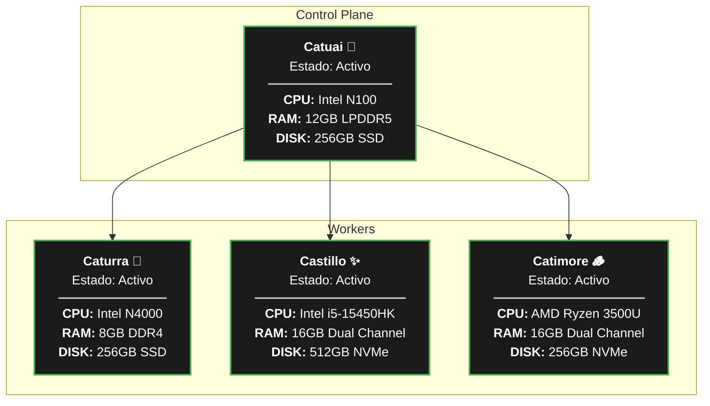

# ☕ Citocafecito Homelab

> "Infraestructura de código abierto, cosechada grano a grano."

Bienvenido a la organización Citocafecito. Este es un espacio de experimentación, autoservicio (self-hosting) y automatización donde gestionamos servidores como granos de especialidad: con precisión, técnica y mucha pasión.

## 🚜 La Finca (Infraestructura y Operaciones)

Nuestros repositorios son públicos porque creemos en el conocimiento compartido. Eres libre de explorar, hacer fork, comentar o proponer mejoras mediante Pull Requests.

## ⚓ Estado del Cluster

| Estado | Nodo | Variedad | Función |
| :--- | :---: | ---: | ---: |
| Activo | Catuai 🌿 | Plano de Control | Control Plane |
| Activo | Caturra 🍒 | Domótica y Automatizaciones | Worker |
| Activo | Castillo ✨ | Habi* Core Services | Worker |
| Activo | Catimore 🪵 | Multimedia y Servicios *arr | Worker |

## ☕ Variedades de Café

Cada nodo en Citocafecito toma su nombre de una variedad de la planta de café (*Coffea arabica*), reflejando su naturaleza y resistencia en el ecosistema:

### Catuai 🌿 (Control Plane)

Una variedad compacta y de alta productividad que requiere un cuidado minucioso. Ideal como el cerebro del cluster para centralizar la orquestación de manera eficiente.

### Caturra 🍒 (Worker - Domótica)

Una mutación natural de porte bajo, muy común y accesible, excelente para ramificarse y gestionar sensores de hogar, automatizaciones y servicios ligeros de domótica.

### Castillo ✨ (Worker - Habi* Core)

Desarrollada para ser altamente resistente a enfermedades y de gran rendimiento. Soporta el núcleo de los servicios principales de la infraestructura y bases de datos.

### Catimore 🪵 (Worker - Multimedia & Apps)

Un cruce híbrido (Híbrido de Timor y Caturra) conocido por su vigor, robustez y resistencia a plagas. Es el nodo de alto rendimiento encargado de procesar la carga pesada de transcodificación multimedia y gestión de datos.

## 📊 Gráfico de Estado

> Cualquiera es bienvenido a contribuir o utilizar nuestro contenido como base para sus propios proyectos de Homelab.
