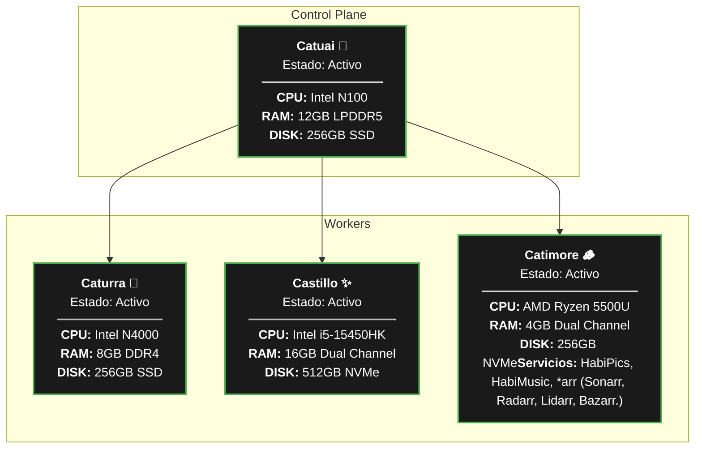

# ☕ Citocafecito Homelab

> "Infraestructura de código abierto, cosechada grano a grano."

Bienvenido a la organización Citocafecito. Este es un espacio de experimentación, autoservicio (self-hosting) y automatización donde gestionamos servidores como granos de especialidad: con precisión, técnica y mucha pasión.

## 🚜 La Finca (Infraestructura y Operaciones)

Nuestros repositorios son públicos porque creemos en el conocimiento compartido. Eres libre de explorar, hacer fork, comentar o proponer mejoras mediante Pull Requests.

## ⚓ Estado del Cluster

| Estado    | Nodo | Variedad | Función |
|----------|:--------------:|--------------------:|---------:|
| Activo    | Catuai 🌿 | Plano de Control | Control Plane |
| Activo    | Caturra 🍒 | Domótica y Automatizaciones |  Worker  |
| Activo    | Castillo ✨ | Habi* Services | Worker |
| Activo    | Catimore 🪵 | Multimedia y Servidores *arr | Worker |

> Cualquiera es bienvenido a contribuir o utilizar nuestro contenido como base para sus propios proyectos de Homelab.
